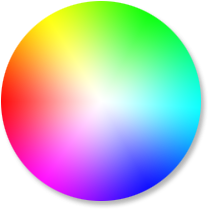
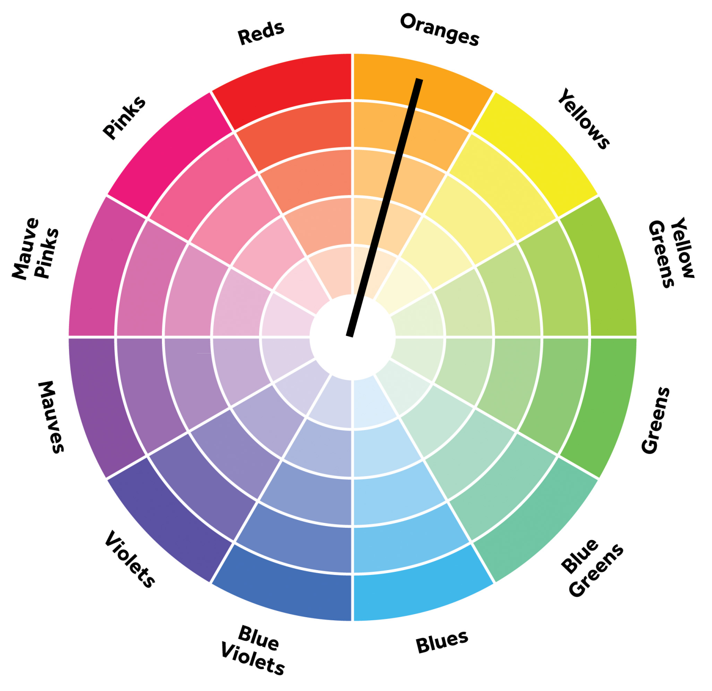
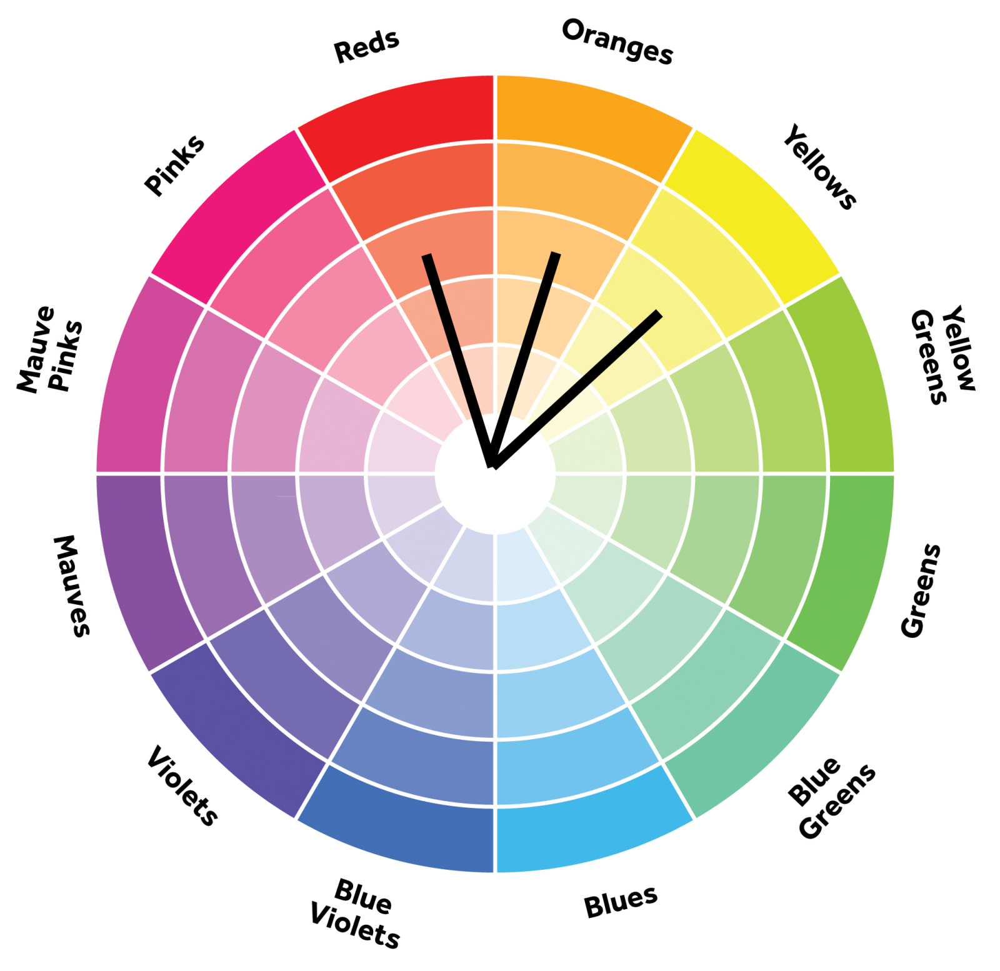
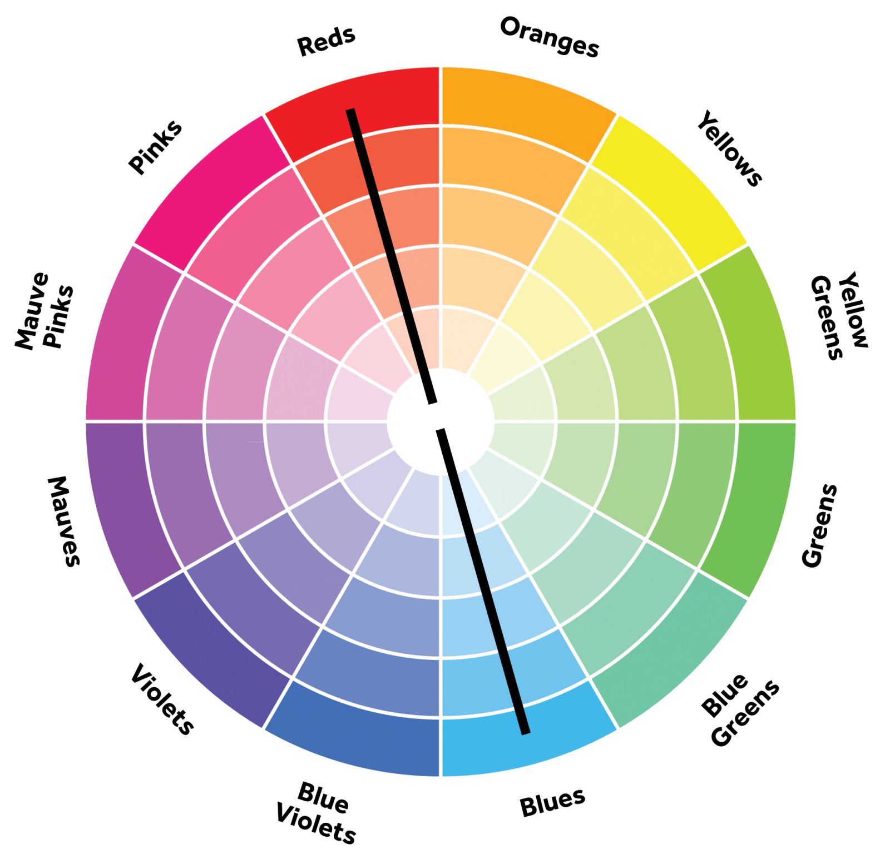

# Design 

## Você sabe como combinar cores?

Uma dúvida comum entre desenvolvedores, até mesmo dos que trabalham com front-end é: como combinar cores? Nesse artigo algumas técnicas que facilitam esse trabalho.

###Roda de cores

Esta é a roda de cores ou círculo cromático, e vocês agora serão amigos! Ela é quem vai te ajudar a saber se uma cor combina com outra ou não.

Agora, tudo o que precisamos para selecionar cores é de certas formas geométricas. Sim, nós veremos como a matemática está relacionada com a harmonia na combinação das cores.

Há várias formas de se combinar cores, e tudo vai depender do que você precisa. Então vamos lá!

### Monocromáticas

Essa é a mais fácil, pois a gente apenas seleciona uma única cor e alteramos seus tons. Mesmo sendo a regra mais fácil, é uma das mais difíceis de se trabalhar. Como é uma única cor, se não utilizada corretamente pode acabar cansando facilmente.

### Análogas

São selecionadas três cores, uma ao lado da outra. Possui pouco contraste, já que são cores muito próximas. Podemos selecionar quatro cores, e então chamaremos de análogas compostas.

As cores análogas são frequentemente encontradas na natureza, o que nos passa uma sensação de harmonia quando encontramos sites com cores baseadas nessa regra.

### Complementares

Cores complementares são aquelas que estão de lados opostos. Por causa disso, causam um grande contraste, já que teremos uma cor quente e uma fria.

### Tríades ou trio harmônico

!Cores Triade Trio Harmonico](CoresTriade_TrioHarmonico.png)

São cores que formam um triângulo equilátero. Você também pode utilizar outros tipos de triângulos e até mesmo retângulos, mas aí já deixa de se chamar tríade.

As cores dessa regra possuem uma harmonia bem contrastante e é sempre recomendado dar destaque a apenas uma das cores selecionadas, mantendo as demais apenas como cores secundárias.

[Artigo original](https://www.treinaweb.com.br/blog/voce-sabe-como-combinar-cores)

